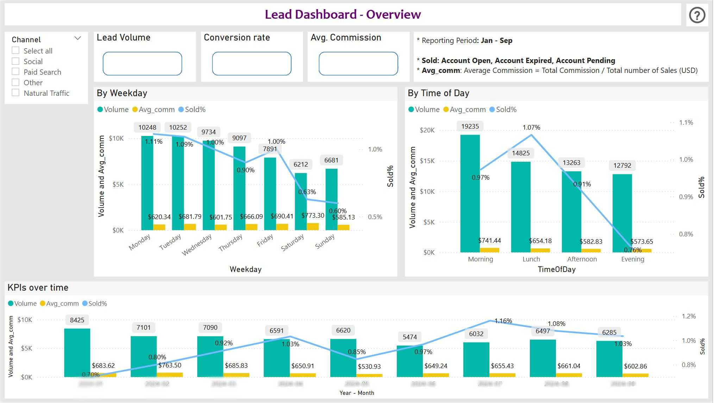

# Lead Analysis Dashboard (Power BI)

This Power BI report analyses lead generation performance by media source and campaign, helping marketing teams understand which channels deliver the best ROI.

## 📌 Overview

The dataset used includes metrics such as:
- Channel (e.g. Google Ads, Facebook, Organic)
- Number of Leads
- Commissions (in £)
- Cost per Acquisition (CPA)
- Return on Ad Spend (ROAS)
- Conversion Funnel stages 

This dashboard helps stakeholders: 
- Which media sources (Google Ads, Facebook, etc.) drive the most leads and highest conversion rate
- Which day and time of day drive the most leads and highest conversion rate 
- How cost-per-lead and ROAS vary across channels 
- Trends in lead volume and conversion over time

## 🛠️ Tools & Technologies

- Power BI (DAX, visualisation)
- SQL (data preprocessing)
- Excel
- Media campaign tracking data 

## 📸 Sample Screenshot

## 🔗 Deployment

The `.pbix` file is not hosted publicly due to company data confidentiality. If you’d like to request access or see a sample version, please [contact me](mailto:rachelhyesoo@gmail.com).

---

📁 local file – not uploaded to GitHub 

