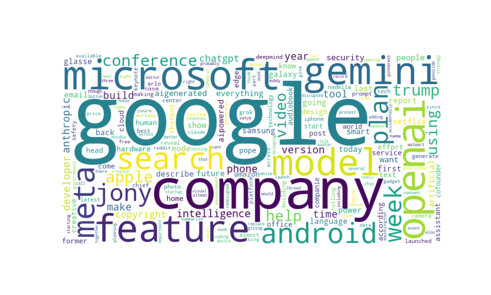

# 📰 News Keyword Analysis with Python

This project collected and analysed recent news articles dated from 5th May 2025 to 4th June 2025, related to **AI** using the News API. 
Text data was cleaned, filtered for stopwords, and lemmatised to identify the most frequent and meaningful keywords. 
The result highlighted dominant entities such as Google, Microsoft, and OpenAI, indicating their strong presence in current AI discourse. 
This project demonstrates basic API handling, NLP techniques and effective keyword visualisation with WordCloud. 

## 🔧 Tools & Libraries Used
- Python
- NewsAPI
  
- re (regex) 
- collections.Counter
- nltk 
- matplotlib
- WordCloud 

## 📊 What It Does
- Collects recent news articles using a query (e.g. "AI")
- Cleans the text (removing special characters, converting to lowercase)
- Extracts and counts words with length > 3
- Generates a Word Cloud visualisation

## 🔍 What It Says 
- 'Google', 'Microsoft', 'Gemini', 'OpenAI' are the most frequent words mentioned in news articles for the period of 5th May 2025 to 4th June 2025 

## 💻 Sample Output

