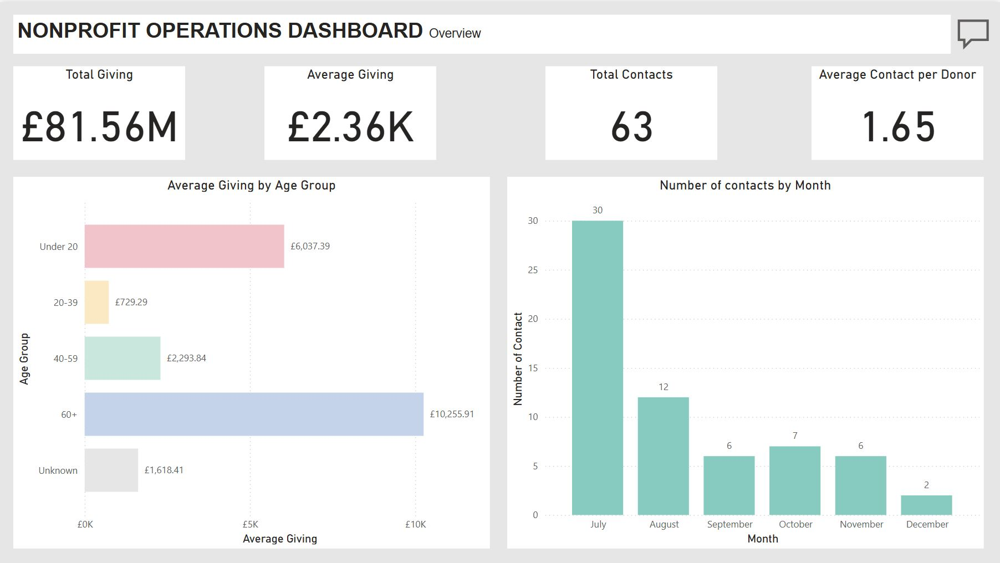

# 📊 Nonprofit Operations Dashboard & Automation 

A Python + Power BI project for automating monthly KPI reports for a nonprofit organisation.

## 🔍 Objectives
- Analyse donation and contact patterns
- Automate KPI extraction and reporting
- Build a Power BI dashboard for ongoing monitoring

## 🛠️ Tools
- Python (pandas, sqlite3, yagmail)
- SQL
- Power BI
- Excel

## 📈 KPIs Tracked
1. Total Giving
2. Average Giving
3. Total Contacts
4. Average Contact per Donor
5. Average Giving by Year (Past 5 Years)
6. Average Giving by Age Group
7. Average Giving by Gender
8. Average Giving by Wealth Rating
9. Contact Volume by Month
10. Contacts by Staff
11. Contacts by Method
12. Outcome Ratio (Positive vs. Negative)

## 📬 Automation
- Scheduled email delivery using yagmail
- Data loaded via SQLite and analysed with SQL in Python

## 📊 Power BI Dashboard
Three-page interactive dashboard covering:
- Overview
- Donor Insight 
- Contact Performance



## 🔮 Insights & Recommendations
- Focus on high-value age and wealth segments
- Optimise contact methods with better outcomes
- Balance contact workload across the year

## 📂 File Structure 
```
Nonprofit Operations Dashboard/
├── data/ # Raw input data
│ ├── Fundraising_donor_data.csv
│ └── Fundraising_contact_reports.csv
├── notebooks/ # Exploratory data analysis & prototyping
│ └── Operations Report.ipynb
├── reports/ # Output reports
│ ├── monthly_kpi_report.xlsx
│ └── Operations Report.pbix
├── README.md # Project overview and usage
```
---

## 👩‍💻 Author

**Hyesoo Park**  
Data Analyst | Power BI, SQL, Python for Data  
[Portfolio](https://hyesoopark.co.uk) • [LinkedIn](https://linkedin.com/in/hyesoopark) • [GitHub](https://github.com/phs928)

