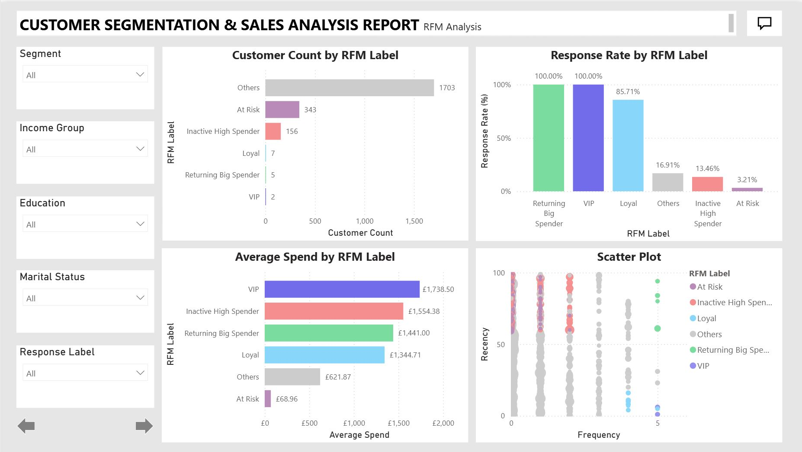

# 📊 Customer Segmentation & Sales Analysis  

This project analyses customer transaction data by product type and purchase channel, and applied RFM to segment customers using SQL and Power BI. 
It is divided into 4 parts: 

1. Customer Segmentation Analysis 
2. Product Type Analysis 
3. Purchase Channel Analysis
4. RFM Analysis

## 📑 Table of Contents
1. [Dataset](#-dataset)
2. [Tools](#tools)
3. [1. Customer Segmentation Analysis](#1-customer-segmentation-analysis)
4. [2. Product Type Analysis](#2-product-type-analysis)
5. [3. Purchase Channel Analysis](#3-purchase-channelcaAnalysis)
6. [4. RFM Analysis](#4-rfm-analysis)
7. [Power BI Dashboard Overview](#power-bi-dashboard-overview)
8. [Dashboard Screenshots](#dashboard-screenshots) 
9. [Sample SQL Queries](#sample-sql-queries)
10. [Author](#author) 

## 📁 Dataset

- **Source**: [Kaggle - Marketing Campaign Dataset](https://www.kaggle.com/datasets/rodsaldanha/arketing-campaign)
- **Data**: Customer demographics, campaign responses, product spending, channel interactions
- **Size**: 2,216 records after cleaning 

## 🛠️ Tools

- **Microsoft SQL Server**: Data cleaning and preprocessing 
- **Power BI**: Dashboard development and visual insight generation


## 🔎 1. Customer Segmentation Analysis 

This part segments customers based on their demographic features to understand which segments are the most responsive to campaigns and valuable 

### 🎯 Objectives: 
- Profile customers by demographic attributes 
- Identify high-value and high-responsive customer segments

### 🧩 Key Steps 
1. ***Dataset Loading*** 
2. ***Data cleaning & transformation***
   - Handled missing values in `income` 
   - Reclassified and created new variables: `income_band`, `age_band`, `children_group`
3. ***Demographic segmentation*** 
   - Manually defined segments using age, income, marital status, education, and child presence
   - Assigned labels such as:
     *"Young Professionals"*, 
     *"Middle-aged Married Parents"*, 
     *"Budget-Conscious Families"*,
     *"Married No Kids"*,
     *"Solo Households"*,
     *"Older Married Parents"*,
     *"Other group"* 
4. ***KPI Analysis***
   - Calculated campaign `response_rate` per segment
   - Measured average `spend per product category` across segments 

### 🔍 Key Insights

- The "Married No Kids" segment showed the **highest total spend** 
- "Young Professionals" segment had the **highest average spend** and **response rate** 


## 🛒 2. Product Type Analysis 

This section analyses which products customers prefer and spend most on (i.e., Wine, Fruits, Meat, Sweet, Fish, Gold) 

### 🎯 Objectives:
- Identify most popular product types by spend  
- Understand purchasing patterns by segment 

### 🔍 Key Insights
- **Wines** accounted for **over 50%** of total customer spending  
- High-value customers showed consistent interest in Meat and Gold as well


## 🛍️ 3. Purchase Channel Analysis 

This part explores how customers interact with different purchase channels (store, catalogue, web)

### 🎯 Objectives:
- Measure average and total transactions by channel  
- Identify channel preferences by segment 

### 🔍 Key Insights
- **Store** was the most used channel (46.2% of transactions), followed by **web** (32.5%)  
- High-value customers tended to use multiple channels


## 🧮 4. RFM Analysis 

This section evaluates customer value using **Recency**, **Frequency**, and **Monetary** scoring

### 🎯 Objectives:
- Score customers based on purchase recency, frequency, and spending  
- Classify customers into value-based segments (e.g. VIP, Loyal, At Risk)

### 🧩 Key Steps
- Created **Recency Score** (based on days since last purchase)  
- Created **Frequency Score** (based on number of accepted campaigns)  
- Created **Monetary Score** (based on total spend)  
- Assigned two RFM labels:
  - **Simple**: Based on Recency & Frequency
  - **Extended**: Based on Recency, Frequency & Monetary

### 🔍 Key Insights
- Over **38%** of customers were classified as **At Risk**  
- Only **0.1%** of customers qualified as **VIP**, suggesting highly selective criteria (avg spend: £1,738.50) 


## 📊 Power BI Dashboard Overview 

| Page | Description |
|------|-------------|
| **Page 1 – Executive Overview** | KPIs, top segments/products/channels summary |
| **Page 2 – Customer Segmentation** | Response rate, spend, count by segment |
| **Page 3 – Product Type Analysis** | Spend and penetration by product type |
| **Page 4 – Channel Analysis** | Channel usage, average transactions |
| **Page 5 – RFM Analysis** | R/F/M scoring and customer labelling |


## 📷 Dashboard Screenshots




👉 See full interactive report screenshots in `/images` folder.

## 📦 Sample SQL Queries

```sql

with age_segment as ( 
select 
	Year(getdate()) - [Year_Birth] as age  
	,case when Year(getdate()) - [Year_Birth] < 45 then 'Under 45' 
		when Year(getdate()) - [Year_Birth] between 45 and 59 then '45-59'
		when Year(getdate()) - [Year_Birth] between 60 and 74 then '60-74' 
		when Year(getdate()) - [Year_Birth] >= 75 then '75+' 
	else 'Unknown' 
	end as age_segment 
from dbo.marketing_campaign 
)
select 
	age_segment 
	,count(*) as count 
from age_segment 
group by age_segment 
order by case age_segment
        when 'Under 45' then 1
        when '45-59' then 2
        when '60-74' then 3
        when '75+' then 4
        else 5
    end;

alter table dbo.marketing_campaign 
add Total_spend int, Total_trx int, Total_Deal_trx int  
go 


update dbo.marketing_campaign 
set Total_spend = b.Total_spend, 
	Total_trx = b.Total_trx,
	Total_Deal_trx = b.Total_Deal_trx 
from dbo.marketing_campaign a, 
	(select 
	ID 
	,Year_Birth
	,MntWines + MntFruits + MntMeatProducts + MntFishProducts + MntSweetProducts + MntGoldProds as Total_spend 
	,NumStorePurchases + NumWebPurchases + NumCatalogPurchases as Total_trx 
	,NumDealsPurchases as Total_Deal_trx 
	from dbo.marketing_campaign 
	) b 
where a.ID = b.ID and a.Year_Birth = b.Year_Birth

```
---

## 🌐 Portfolio
View this project on my website: [hyesoopark.co.uk](https://hyesoopark.co.uk)

---

## 👩‍💻 Author

**Hyesoo Park**  
Data Analyst | Power BI, SQL, Python for Data  
[Portfolio](https://hyesoopark.co.uk) • [LinkedIn](https://linkedin.com/in/hyesoopark) • [GitHub](https://github.com/phs928/portfolio)
