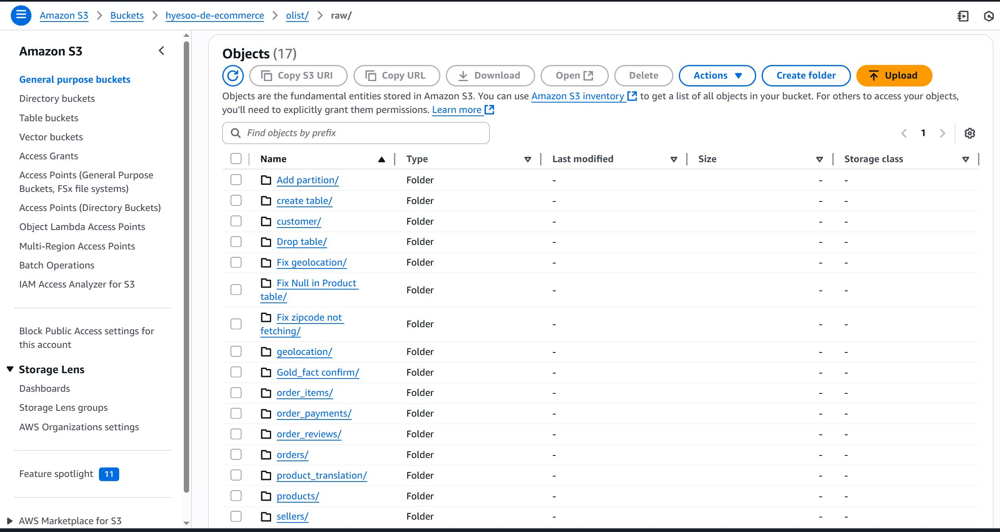
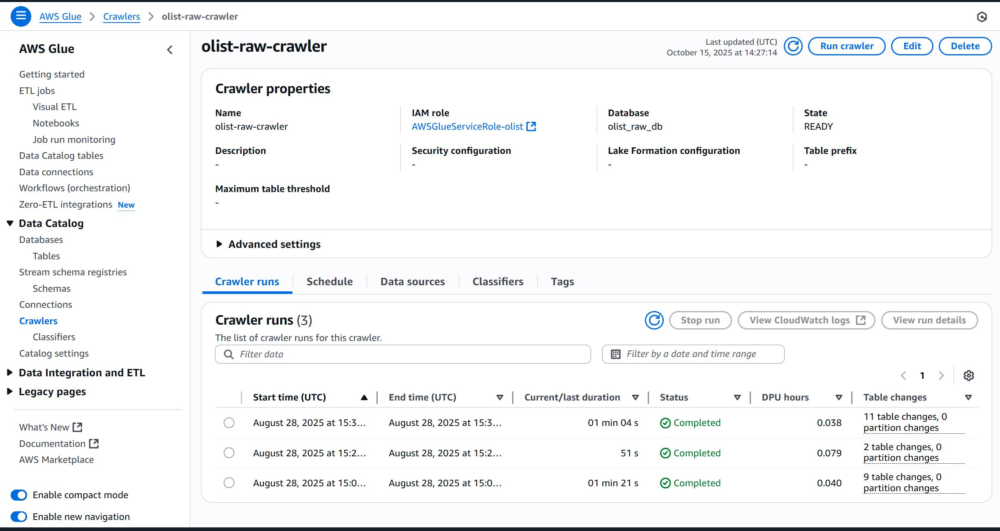
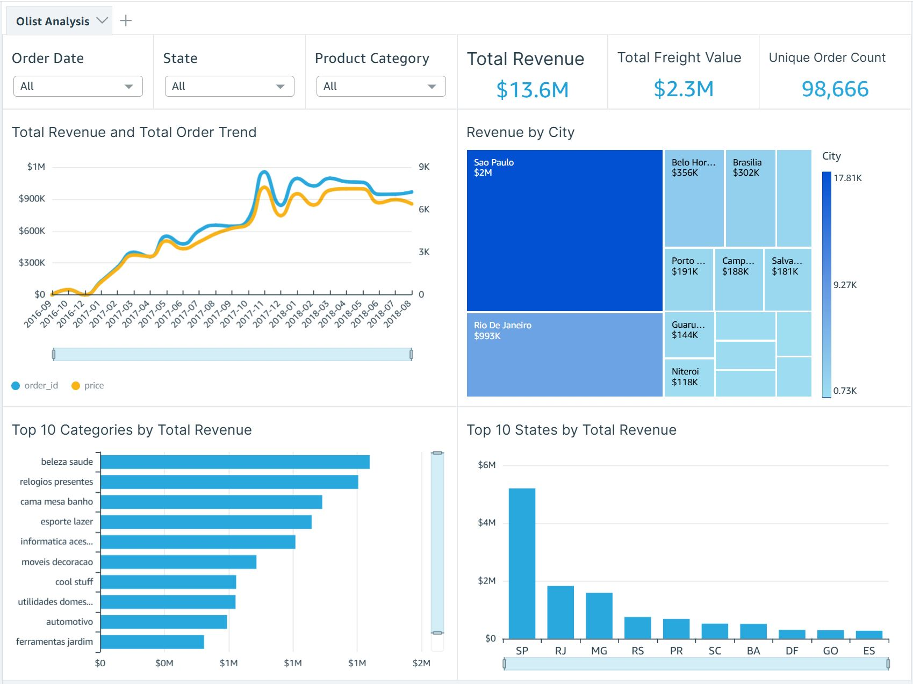

# 📊 E-commerce Sales Data Pipeline 

This project builds an end-to-end **data pipeline and analytics workflow** using AWS services.
It simulates a real-world data engineering workflow from raw file ingestion to building an interactive dashboard that provides insights into sales, revenue, and customer trends.

---

## 📑 Table of Contents
1. [Dataset](#dataset)
2. [Project Overview](#project-overview)
3. [Architecture](#architecture)
4. [Tech Stack](#tech-stack)
5. [Workflow Steps](#workflow-steps)
6. [Workflow Screenshots](#workflow-screenshots) 
7. [Dashboard Screenshot](#dashboard-screenshot)
8. [Dashboard Features](#dashboard-features)
9. [Data Cleaning Highlights](#data-cleaning-highlights) 
10. [Key Learnings](#key-learnings)
11. [Author & Contact](#%E2%80%8D-author--contact)

---

## Dataset
Brazillian supermarket, Olist E-Commerce dataset: [Olist eCommerce dataset](https://www.kaggle.com/datasets/olistbr/brazilian-ecommerce) 
The dataset contains: 
- 112K+ orders (98K+ unique orders) 
- 99K+ customers
- 32K+ products
- Multiple geographies (city/state level) 

## Project Overview 
To deliver a scalable, cloud-based data pipeline that enables interactive business reporting on revenue trends, product category performance, and regional sales distribution. 

## Architecture 
- **AWS S3**: Raw → Silver → Gold layer storage
- **AWS Glue**: ETL and data cleaning scripts (PySpark)
- **AWS Athena**: Data modelling via SQL (fact & dimension tables)
- **Amazon QuickSight**: Interactive dashboard with direct Athena connection

## Tech Stack

| Tool/Service         | Purpose                          |
|----------------------|----------------------------------|
| **AWS S3**           | Data lake for raw/silver/gold    |
| **AWS Glue**         | Data cleaning & transformation   |
| **AWS Athena**       | Query engine for gold layer      |
| **QuickSight**       | BI dashboard                     |
| **PySpark**          | Data wrangling in Glue scripts   |
| **SQL**              | Data modelling in Athena         |


## Workflow Steps
Data Pipeline Flow

```plaintext
Kaggle CSVs
   ↓
AWS S3 (Bronze Layer: Raw CSVs)
      ↓
AWS Glue (bronze-to-silver jobs)
      ↓
AWS S3 (Silver Layer: Cleaned Parquet)
      ↓
AWS Glue (silver-to-gold jobs)
      ↓
AWS S3 (Gold Layer: Star Schema: fact & dim tables)
      ↓
Athena (SQL Query Layer)
      ↓
Amazon QuickSight (Final Dashboard)
```

## Workflow Screenshots 

I first uploaded the CSV files in AWS S3 bucket as olist/raw folder.  

 

Then I created and ran the AWS Glue Crawler to create schema. 

 


## Dashboard Screenshot




👉 See full interactive report screenshots in `/image` folder.

## Dashboard Features

- 📈 Total revenue and order trends over time
- 🗺️ Top-performing cities and states by revenue
- 📦 Top product categories by revenue
- 📦 Key Metrics:
  - **Total Revenue**: `$13.6M`
  - **Total Freight Value**: `$2.3M`
  - **Total Orders**: `112,650`
  - **Total Unique Orders**: `98,666`

## Data Cleaning Highlights

- Removed nulls and empty strings from key fields
- Normalised date formats and product categories
- Handled inconsistent city/state naming
- Casted revenue fields to numeric types
- Generated date dimension and load_date partitioning

## Key Learnings

- Developed modular Glue jobs with idempotent partition writes
- Built SQL data models in Athena with star schema
- Created a fully cloud-based BI dashboard for real-world sales data 


---

## 👩‍💻 Author & Contact 

**Hyesoo Park**  
Data Analyst | Power BI, SQL, Python for Data  
[Portfolio](https://hyesoopark.co.uk) • [LinkedIn](https://linkedin.com/in/hyesoopark) • [GitHub](https://github.com/phs928/portfolio)
