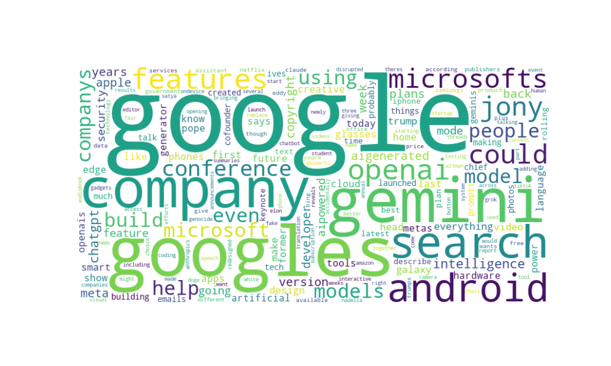

# 📰 News Keyword Analysis with Python

This project analyses recent news articles related to **AI** using the News API.  
It performs keyword extraction, text cleaning, and word frequency analysis to generate insights.

## 🔧 Tools & Libraries Used
- Python
- NewsAPI
  
- re (regex) 
- collections.Counter
- nltk 
- matplotlib
- WordCloud 

## 📊 What It Does
- Collects recent news articles using a query (e.g. "AI")
- Cleans the text (removing special characters, converting to lowercase)
- Extracts and counts words with length > 3
- Generates a Word Cloud visualisation

## 💻 Sample Output

